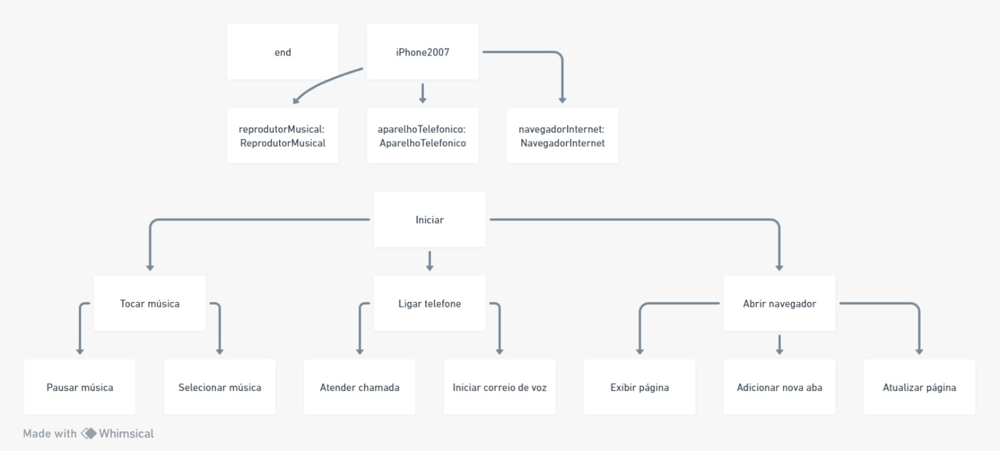

@startuml

class iPhone2007 {
    + reprodutorMusical: ReprodutorMusical
    + AparelhoTelefonico: AparelhoTelefonico
}

class ReprodutorMusical {
    + tocar()
    + pausar()
    + selecionarMusica()
}

class AparelhoTelefonico {
    + ligar()
    + atender()
    + iniciarCorreioVoz()
}

class NavegadorInternet {
    + exibirPagina()
    + adicionarNovaAba()
    + atualizarPagina()
}

iPhone2007 --> ReprodutorMusical
iPhone2007 --> AparelhoTelefonico

@enduml

